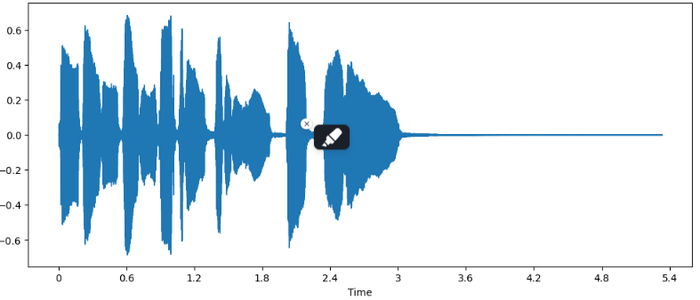

# Unit 1. Working with audio data

This unit will lay the foundations of this course by covering and understanding the fundamental terminology related to audio data, including waveform, sampling rate and spectrogram.

# Outline

- [Introduction to audio data](#introduction-to-audio-data)
- [Sampling and Sampling rate](#sampling-and-sampling-rate)
- [Amplitude and bit depth](#amplitude-and-bit-depth)
- [Audio as a waveform](#audio-as-a-waveform)
- [Frequency Spectrum](#frequency-spectrum)
- [Spectrogram](#spectrogram)
- [Mel Spectrogram](#mel-spectrogram)
- [Processing an audio dataset](#processing-an-audio-dataset)
    - [Resampling the audio data](#resampling-the-audio-data)
    - [Filtering the dataset](#filtering-the-dataset)
    - [Pre-processing audio data](#pre-processing-audio-data)
- [Streaming Audio Data](#streaming-audio-data)
- [Additional Resources](#additional-resources)

### Introduction to audio data

- Sound wave  is a continous signal
- Sound need to be converted into digital signal
- analog signal —→ microphone —> electrical signal —> ADC —→ Digital Representation (sampling)

## Sampling and Sampling rate

- Sampling is the process of measuring the value of a continous signal at fixed time steps.
- Sampling rate is the number of samples taken in one second and measured in hertz(Hz)
- The Sampling rate determins the highest frequency that can be captured from the signal which is  called **Nyquist limit = sampling rate/2**
- It’s essential to make sure that all the audio samples have the same sampling rate which coincide with the sampling rate of the model’s pretraining data(Resampling).

## Amplitude and bit depth

- Amplitude: describes the sound pressure level at any given instant and is measured in decibels(dB)
- bit depth: determines with how much precision this amplitude value can be described (the number of bits that are used to encode amplitude values)
- the audio bit is representing the number of possible steps to which the amplitude value can be quantized when it’s converted from continous to discrete, the sampling process introduce noise
- the amplitude of digital studio is typically expressed in decibels (dB), the decibel scale for real world audio starts at 0dB, for digital signals, 0 dB is the loudest possible amplitude

## Audio as a waveform

- waveform is a form of visualizing audio signals, also called time domain representation of sound which plots the sample values over time and illustrate the changes in the sound’s amplitude.
- it plots the amplitude of the audio signal over time

## Frequency Spectrum

- also called frequency domain representation, the spectrum is computed using the discrete fourier transform or DFT, it describe the individual frequencies that make up the signal and how strong they are.
- Power spectrum measures energy rathen than amplitude, this is a spectrum with the amplitude values squared.
- visualize the amplitudes of the individual frequencies at a fixed point in time

## Spectrogram

- Frequency Spectrum is like a snapshot of frequencies at a given instant
- plots the frequency content fo an audio signal as it changes  over time, it allows you to see time, frequency and amplitude all on one graph.
- the algorithm that make this computation is the STFT or Short Time Fourier Transform
- It’s one of the most informative audio tools, it can help in music recording and speech to identify different vowel sounds as each vowel is characterised by particular frequencies.

- it’ s created by :
    - taking short segements of the audio signal
    - calculating the discrete fourier transfrom of each segment
    - stacking the resulting spectra on the time axis
- Each vetical slice in this image corresponds to a single frequency spectrum (seen from the top)
- the spectogram and the waveform are different views of the same data, we can get the waveform from the spectogram by applying the inverse STFT, this require the phase information  in addition to the amplitude information. a phase reconstruction algorithm can be used (Griffin-Lim algorithm)  or using a neural network called a vocoder.

## Mel Spectrogram

- it’s a variation of the spectogram Commonly used in speech processing and machine learning tasks
- it approximates the non-linear frequency response of the human ear
- created using the same steps as the spectogram, additionally each spectrum is sent through a set of filters, the so-called melfilterbank    to transform the frequencies to the mel scale.

- The mel bands define a set of frequency ranges that divide the spectrum into perceptually meaningful components.
- it’s common to express the strength of the mel frequency components in decibels, it’s commonly referred to as a log-mel spectrogram.
- There are two different mel scales in common use (htk and slaney) and instead of the power spectogram the amplitude spectogram can be used
- Conversion to waveform is more difficult, it requires simulating the frequencies that were thrown away using some models such as HiFiGAN vocoder
- mel spectogram can capture more meaningful features of audio signal for human perception

# Processing an audio dataset

## Resampling the audio data

- **Upsampling:** if an audio signal has been sampled at 8kHz, the audio does not contains any frequencies over 4Khz (Nyquist sampling theorem), Upsampling to a higher sampling rate is then a matter of calculating additional samples values.
- **Downsampling**: require that we first filter out any frequencies that would be higher than the new Nyquist limit, before estimating the new sample points. because downsampling with a factor 2x will create distortions in the signal called aliases.

## Filtering the dataset

- To limit the audio exemples to a certain duration

## Pre-processing audio data

- the raw data is converted into input features that the model can work with.
- they depends on the model’s architecture and the data it was pre-trained with.
- Whisper Feature Extractor:  [https://huggingface.co/papers/2212.04356](https://huggingface.co/papers/2212.04356)
    - Padding/Truncuating
        - the audio examples  are padded or truncuated such as all input’s length is 30s
        - no need for attention mask (details where sequences have been padded then where they should be ignored)
        - whisper infer from the speech signals where to ignore the inputs
    - Converting the padded audio arrays to log-mel spectograms(features_input)
- Feature Extractor and Tokenizer for whisper  can be loaded both via processor.

# Streaming Audio Data

- the audio datasets are carachterized by their sheer size.
- Streaming allows us to load rge data progressively as we iterate over the dataset
- Streaming Advantages:
    - **Disk Space**: exemples are loaded one-by-one as we iterate over the dataset
    - **Download and processing time**: loading and processing is done on the fly
    - **Easy Experimentation**: experimentation can be done on a handful of examples to check your scripts
- if the data is reused, the streaming steps must be repeated, it’s advised to download datasets that can be used.

# Additional Resources

| Resource | Description |
|----------|-------------|
| [Digital Signal Processing - An Interactive Approach](https://youtu.be/cIQ9IXSUzuM) | Video tutorial on digital signal processing fundamentals |
| [A Visual Guide to Audio Processing](https://www.youtube.com/watch?v=wqkKResXWB8) | Visual explanation of audio processing concepts |
| [Digital Signal Processing for Music Applications](https://brianmcfee.net/dstbook-site/content/intro.html) | Comprehensive online book about DSP in music |

